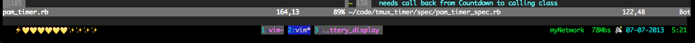
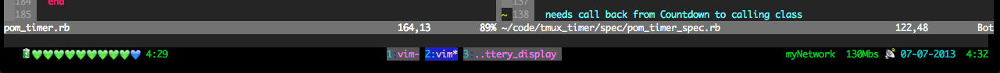
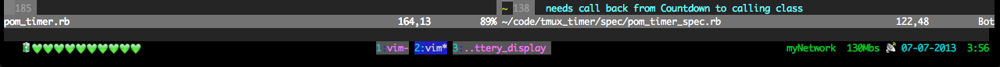
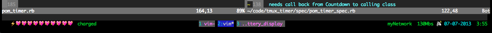

##Tmux Battery Status Display

Charging:
On Battery Power:
Full Charge on Battery Power:
Full on AC:

Just add this to your `.tmux.conf` in the `status-left` or `status-right` and pipe it `pmset -g batt` like this.

`set -g status-left "#(pmset -g batt | ~/bin/battery_hearts.rb)"`
